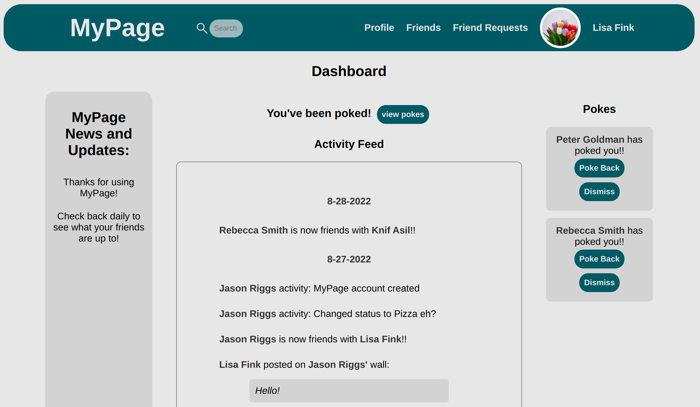

# MyPage Social Media App

A fully functioning social media website
created with React, Firebase, Javascript, and CSS.

# <a href="https://mypage-15a7a.web.app/">Live Preview</a>

## Features:

### User Accounts:

Create an account using firebase authentication

Login page, with sign up, and password reset options. Update account page gives users the option to change their email or password.

### Dashboard:

MyPage news and update menu.

Activity feed that displays all recent activity of friends

Poke menu: Displays pokes received with the option to poke back or dismiss.

### Profile Page:

Displays users name, job, location, and status.

Edit profile: change all information, and upload a profile picture.

Wall: message board for each profile, and displays all recent activity.

Actions: can add or remove a friend or send a poke

### Navigation Bar:

Search: searches for users based on their first or last name.

Friend Requests: displays an alert in real time showing the number of unseen requests. All friend requests are displayed in a drop down menu with the option to accept or reject.

## Screenshots

### Desktop:

 

### Mobile:

 

